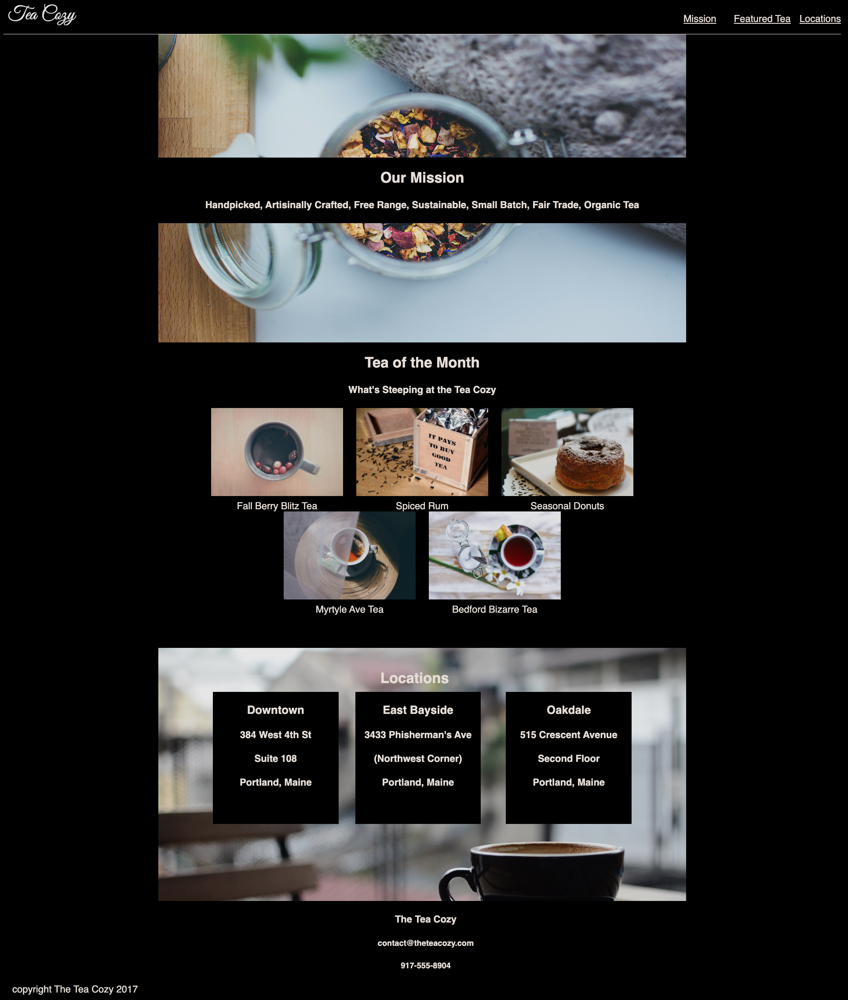

# Codecademy - Tea Cozy solution

This is a solution to the [Tea Cozy challenge on Codecademy](https://www.codecademy.com/journeys/front-end-engineer/paths/fecj-22-improved-styling-with-css/tracks/fecj-22-making-a-website-responsive/modules/wdcp-22-layout-with-flexbox-c6c85b4d-0af4-463c-a524-60d812a4b011/projects/tea-cozy).

## Table of contents

- [Overview](#overview)
  - [The challenge](#the-challenge)
  - [Screenshot](#screenshot)
  - [Links](#links)
- [My process](#my-process)
  - [Built with](#built-with)
  - [What I learned](#what-i-learned)
  - [Continued development](#continued-development)
  - [Useful resources](#useful-resources)
- [Author](#author)
- [Acknowledgments](#acknowledgments)

## Overview

### The challenge

Users should be able to:

- Utilize lessons prior to create the website based on the design spec given.
  

### Screenshot

### Links

- Solution URL: [Add solution URL here](https://github.com/AOseni1/Tea_Cozy)
- Live Site URL: [Add live site URL here](https://aoseni1.github.io/Tea_Cozy/)

## My process

### Built with

- Semantic HTML5 markup
- CSS custom properties
- Flexbox
- CSS Grid

### What I learned

I learned more about responsive design. semantic HTML, and Flexbox.

**Note: Delete this note and add/remove/edit lines above based on what links you'd like to share.**
